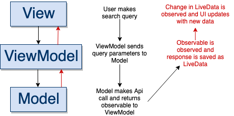
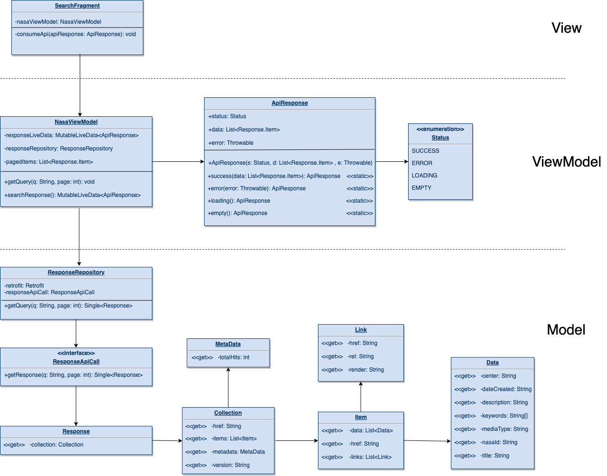

# Space-Search
A simple app that receives search results from NASA's API and displays them to the user within an MVVM design pattern that uses android architecture components, RxJava, Retrofit, Glide and RecyclerView with Fragments.

  

## General design

## Detail design 

## Libraries Used
* Android architecture componets (ViewModel, LiveData).
* RxJava/Android for asynchronous calls.
* Retrofit/GSON-converter for API calls.
* Glide for image rendering.
* Navigation component for fragment interaction.
* RecyclerView for displaying items.

## Instructions
* Download the project from Git and run from Android Studio on any device.
* Java version: 17
* Gradle version: 8.0
* Gradle plugin version: 8.1.2
